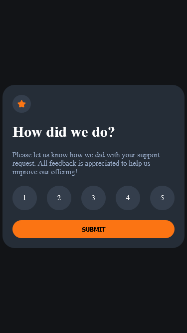
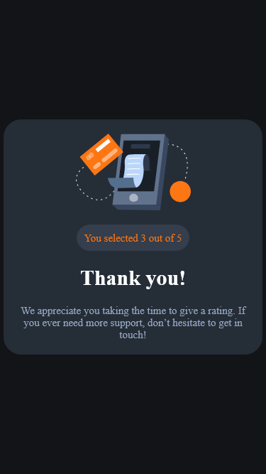

# Frontend Mentor - Interactive rating component solution

This is a solution to
the [Interactive rating component challenge on Frontend Mentor](https://www.frontendmentor.io/challenges/interactive-rating-component-koxpeBUmI).
Frontend Mentor challenges help you improve your coding skills by building realistic projects.

## Table of contents

- [Overview](#overview)
    - [The challenge](#the-challenge)
    - [Screenshot](#screenshot)
    - [Links](#links)
- [My process](#my-process)
    - [Built with](#built-with)
    - [What I learned](#what-i-learned)
- [Author](#author)

## Overview

### The challenge

Users should be able to:

- View the optimal layout for the app depending on their device's screen size
- See hover states for all interactive elements on the page
- Select and submit a number rating
- See the "Thank you" card state after submitting a rating

### Screenshot





### Links

- Solution URL: [Interactive Rating](https://github.com/L-ux-es/InteractiveRating)
- Live Site URL: [Frontend Mentor | Interactive rating component](https://l-ux-es.github.io/InteractiveRating/)

## My process

### Built with

- Semantic HTML5 markup
- CSS custom properties
- Flexbox
- Mobile-first workflow

### What I learned

```css
.hidden {
    display: none;
}

.visible {
    opacity: 1;
    visibility: visible;
}
```

## Author

- GitHub - [L-ux-es](https://github.com/L-ux-es)
- Frontend Mentor - [@L-ux-es](https://www.frontendmentor.io/profile/L-ux-es)

